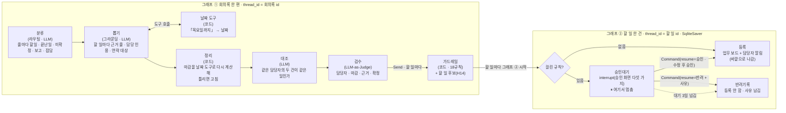
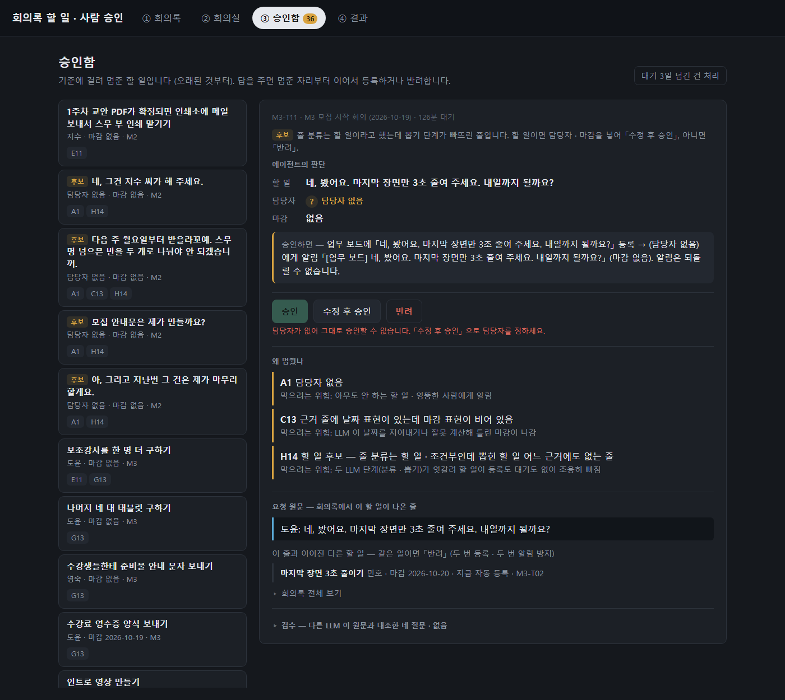
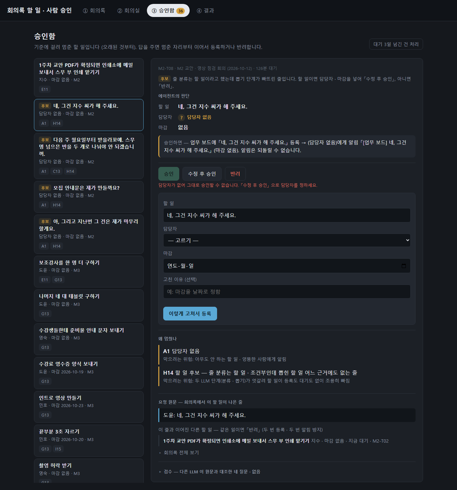
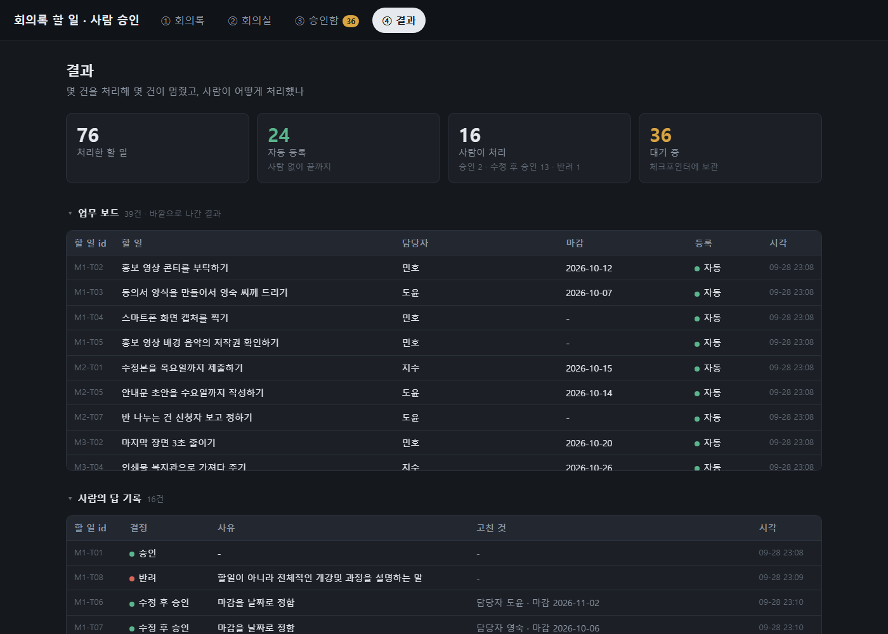
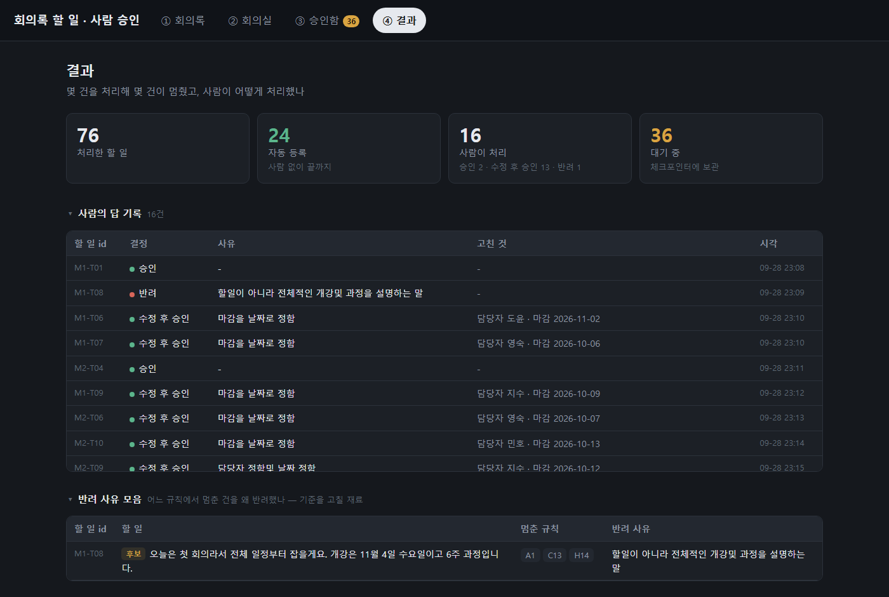
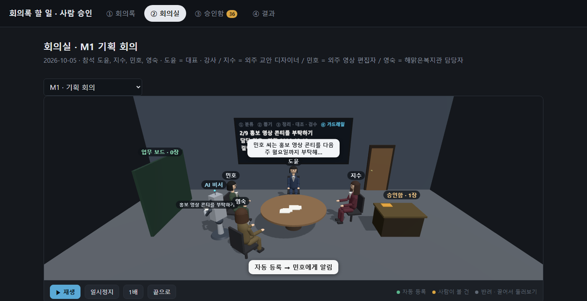
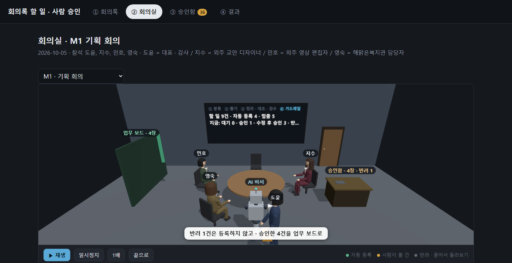

# REPORT — 회의록 할 일 자동 등록에 사람 승인 붙이기

회의록에서 할 일을 뽑아 **업무 보드에 등록하고 담당자에게 알림을 보내는** 자동화입니다.
알림은 되돌릴 수 없어서, 그 **직전**에 위험한 건만 멈추고 사람의 답을 받아 이어서 실행합니다.

## 1. 주제와 고른 이유

**업무**: 1인 기업 대표(도윤)가 외주 협력자(교안 디자이너 지수 · 영상 편집자 민호)와 복지관 담당자(영숙)와 함께
시니어 대상 「AI 비서와 함께하는 스마트폰 교실」 을 운영한다. 회의가 끝나면 회의록에서 할 일을 뽑아 업무 보드에 올리고 담당자에게 알린다.

**결과가 바깥으로 나가는 단계**: 업무 보드 등록 + 담당자 알림. 알림은 사람에게 닿는 순간 되돌릴 수 없고,
틀린 담당자 · 틀린 마감 · 회의에서 정하지 않은 일이 알림으로 나가면 수습이 오래 걸린다. 그래서 **등록 · 알림 바로 앞**에서 멈춘다.

**고른 이유**
- 회의록 한 편에 할 일이 여러 개라, 한 번 돌려도 자동 · 멈춤이 섞여 **기준을 비교할 건수**가 나온다
- 틀리는 모양이 서로 다르다 — 담당자(말한 사람 ≠ 하는 사람) · 마감(「목요일까지」 → 날짜) · 지어낸 일 · 끝난 일 · 다음 기수 이야기 · 중복
- 승인 화면이 짧다 (회의록 한두 줄 + 할 일 한 건)
- 작성자의 실제 업무 영역(시니어 AI 교육)이다

**자료**: 회의록 7편 (`data/meetings/`, M1~M6 · M8 · 발언 17~27줄) — 4편은 Claude 초안, **2편(M5 · M6)은 작성자가 실제 말투(경상도 사투리 포함)로 직접** 썼고,
M8 은 Claude 초안을 작성자가 확인했다. 정답(`data/gold.json`)은 할 일 63건 · 그중 **「사람이 봐야 함」 9건** · 할 일이 아닌 함정 줄 35개이며, 모두 작성자가 확정했다.

## 2. 파이프라인 구조도

그래프 두 개를 쓴다. **회의록 한 편 = 그래프 ① 한 번**, **할 일 한 건 = 그래프 ② 한 번** (thread_id 가 할 일마다 따로).
한 그래프로 하면 멈춘 건 하나가 같은 회의의 자동 건 등록까지 막는다 (`tests/test_langgraph_behavior.py` 시험 1 에서 확인).

**State (상태)**

| 그래프 | 칸 | 들어가는 것 |
|---|---|---|
| ① `회의상태` | `회의id` · `분류` | 회의록 id · 줄마다 종류 |
| | `메시지` · `반복` | 뽑기 ⇄ 날짜 도구 대화 (반복 상한 6) |
| | `도구기록` | 날짜 도구가 돌려준 값 |
| | `할일들` | 뽑힌 할 일 (정리 · 대조 · 검수 결과가 붙음) |
| | `대조기록` · `뽑기경고` | 중복 판단 · 모양이 틀려 버린 뽑기 답 |
| | `검사결과` | 가드레일이 할 일마다 붙인 `걸린규칙` (Send 결과를 모음) |
| ② `할일상태` | `할일id` · `회의id` · `회의일` · `할일` | 할 일 한 건 |
| | `답` | 사람의 답 `{결정, 수정, 사유}` |
| | `결과` | 자동 등록 · 승인 등록 · 수정 후 승인 등록 · 반려 |

**멈추는 지점과 재개 경로**
- 멈춤: 그래프 ② `승인대기` 노드의 `interrupt(...)`. 이 노드 안에는 **interrupt 만** 있다.
  LangGraph 는 이어갈 때 멈춘 노드를 첫 줄부터 다시 실행하므로, 등록 · 알림은 다음 노드(`등록`)에만 둔다
  (`tests/test_langgraph_behavior.py` 시험 2: 멈춘 노드 몸통이 두 번 도는 것을 확인)
- 재개: 화면의 답 → `Command(resume={결정, 수정, 사유})` → 같은 thread_id 로 이어서 `등록` 또는 `반려기록`
- 보관: 체크포인터 = `SqliteSaver` (`output/checkpoints.sqlite`). 「다음 단계가 `승인대기` 로 남은 thread」 = 대기 목록.
  **서버를 껐다 켜도 대기 건이 그대로 남고 이어서 처리된다** (시험 · 4절)
- 대기 시한: 3일을 넘기면 자동 **반려** + 주최자(도윤)에게 알림. 자동 승인은 하지 않는다 (놓침이 더 비싸다)

### 2-1. 이번 모듈의 패턴을 어디에 썼나

| 모듈 노드 | 패턴 | 이 프로젝트에서 하는 일 | 코드 |
|---|---|---|---|
| 1 워크플로 설계 | 상태 그래프 · 조건부 분기 | 그래프 두 개 · 「기준에 걸림 / 안 걸림」 · 「승인 / 반려」 분기 | `meeting_graph.만들기` · `task_graph.만들기` |
| 2 뉴스레터 | 단계 연결 + 자동 검수 + 발행 | 분류 → 뽑기 → 정리 → 대조 → **검수 LLM 이 원문과 대조**(네 질문) → 등록 (= 발행 자리 · 여기서 HITL) | `검수` 노드 |
| 2 | `Send` 병렬 | 할 일마다 가드레일 검사를 동시에 | `나누기` |
| 4 고객 응대 | 라우팅 | 줄마다 종류를 표시 (버리지 않고 표시만 · 뽑기가 빠뜨린 할 일은 H14 가 이 표시로 찾음) | `분류` |
| 4 | 그라운딩 | 할 일은 회의록 근거 줄로만 · 담당자 · 연락 대상에도 근거 인용 · D7 이 원문과 대조 · 승인 화면 「요청 원문」 | `뽑기` · 규칙 D |
| 10 | HITL | `interrupt` · `Command(resume)` · `SqliteSaver` · 대기 목록 · 3일 시한 | `task_graph` |
| 모듈 밖 | 도구 호출 | LLM 이 스스로 날짜 도구를 부름 · 정리 노드가 같은 도구로 다시 계산해 틀린 마감을 고침 | `dates.py` · `정리` |

**뺀 패턴과 이유**: 6 GraphRAG — 회의록에 그래프로 엮을 지식이 없다 · 8 오케스트레이션 — 회의록 한 편이 20줄 안팎이라 나눠 맡길 거리가 없다 ·
반성(스스로 고치기) — 검수에서 걸린 건은 LLM 이 고치게 하지 않고 사람에게 보낸다.

**Main Quest 목표와의 대응**
- 모듈의 패턴으로 **내 업무(시니어 교육 운영의 회의록 → 할 일 등록)** 를 자동화 → 1절 · 위 표
- 모든 건을 사람이 보지 않고 **위험한 건에서만 멈추는 기준**과 **그 기준이 맞는 이유** → 3절 (규칙 · 막는 위험 · 자동 처리 건의 예와 정확도 · 비교표).
  다만 지금은 멈춤이 72% 이고 그 절반이 헛멈춤이라 「위험한 건에서만」 은 충분히 이루지 못했다 → 6절 보완점

## 3. 승인 기준과 그 이유

### 3-1. 기준 목록 — 9묶음 18규칙 · 모두 코드로 계산 (`agent/rules.py`)

하나라도 걸리면 멈춘다. G13 · I15 는 LLM 답(참/거짓)을, H14 는 분류 결과를 코드가 읽어 판정한다.

| 묶음 · 막으려는 위험 | 규칙 | 계산 |
|---|---|---|
| **A 담당자 불분명** — 아무도 안 하는 할 일 · 엉뚱한 사람에게 알림 | A1 | 담당자가 비어 있음 |
| | A2 | 담당자가 참석자 명단에 없음 |
| | A3 | 「다 같이 · 우리 팀 · 누가」 가 담당자나 근거에 있음 |
| | A4 | 부탁하는 말(주세요 · 주이소 · 부탁해요)인데 담당자 = 그 말을 한 사람 |
| **B 마감 임박 + 재확인 실패** — 틀린 채 등록되면 바로잡을 시간이 없음 | B4 | 마감이 회의일부터 3일 안이고, ① 날짜 도구로 다시 계산한 값 ② 마감 표현이 근거에 있음 ③ 담당자가 참석자 — 중 하나라도 아님 |
| **C 마감 불확실** — 날짜를 지어내거나 잘못 계산한 마감이 나감 | C5 | 마감 표현은 있는데 날짜가 비었음 (날짜 도구가 「원래 모호」 라 한 표현은 뺌) |
| | C6 | 모호한 표현(쯤 · 가능하면 · 이번 주 안에)인데 날짜가 들어감 |
| | C10 | 마감이 회의일보다 앞 |
| | C12 | 마감이 마감 표현을 날짜 도구로 다시 계산한 값과 다름 (정리 노드가 고칠 수 있는 건은 이미 고친 뒤) |
| | C13 | 근거 줄에 날짜 표현이 있는데 마감 표현이 비었음 |
| **D 근거 불일치** — 회의에서 하지 않은 말을 할 일로 만듦 | D7 | 근거 줄이 회의록 원문에 글자 그대로 없음 |
| | D8 | 담당자 이름이 근거 줄에 없음 (부탁 줄 바로 앞의 화자 = 부탁받은 사람이면 뺌) |
| **E 미확정 논의** — 정하지 않은 이야기를 할 일처럼 등록 | E9 | 「검토해 보자 · 보류 · 다음에 다시」 |
| | E11 | 「되면 · 확정되면」 (「되면서」 는 뺌) |
| **F 바깥 연락 (업무 정책)** — 할 일이 회사 밖 사람에게 닿음 | F12 | 뽑기가 낸 연락 대상이 팀 밖(복지관 · 수강생 · 인쇄소 등) |
| **G 검수 불합격** — 규칙이 글자로 못 잡는 착오 | G13 | 검수 LLM 의 네 질문(담당자 · 마감 · 근거 · 확정) 중 아니오가 하나라도 |
| **H 뽑기 누락 의심** — 할 일이 등록도 대기도 없이 조용히 빠짐 | H14 | 분류는 「할일 · 조건부」 인데 어느 할 일의 근거에도 없는 줄 → 「할 일 후보」 로 사람에게 |
| **I 중복** — 같은 할 일에 알림 두 번 | I15 | 대조 LLM 이 같은 담당자의 앞 건과 같은 일이라고 봄 |

**원문 예시 기준(「담당자 불분명 · 마감 3일 안」)을 그대로 쓰지 않은 부분**: 「3일 안」 만으로 멈추면 맞게 뽑힌 급한 할 일이 모두 멈췄다
(v1 측정에서 B4 16건 중 막으려던 위험에 해당한 건 0). 그래서 **급하면 한 번 더 확인하고, 확인이 실패할 때만** 멈추게 바꿨다 (B4).
F12 는 맞게 뽑혀도 대표가 보기로 한 **업무 정책**이다.

### 3-2. 자동으로 처리되는 건은 왜 사람이 안 봐도 괜찮은가

자동 처리 = 위 18규칙에 하나도 안 걸린 건이다. 즉 아래가 **모두 코드로 확인된** 건이다.
- 담당자가 참석자이고 근거 줄에 이름이 나오며, 부탁한 사람을 담당자로 잘못 적지 않았다 (A · D8)
- 근거 줄이 회의록에 글자 그대로 있다 (D7)
- 마감은 비었거나, 근거 줄의 마감 표현을 **날짜 도구가 계산한 값**과 같다 (C) — LLM 이 날짜를 잘못 옮기면 정리 노드가 도구 값으로 고친다
- 미확정 · 조건 표현이 없고, 바깥 연락이 없다 (E · F)
- 다른 LLM 이 원문과 대조해 네 질문 모두 「예」 라고 했다 (G) · 같은 일을 두 번 뽑지 않았다 (I)

**자동 처리 건의 예** (시연 자료 · M1~M8)
| 회의록 | 할 일 | 담당 · 마감 | 근거 줄 |
|---|---|---|---|
| M1 | 홍보 영상 콘티 | 민호 · 10-12 | 도윤 「민호 씨는 홍보 영상 콘티를 다음 주 월요일까지 부탁해요」 → 민호 「콘티요? 네, 월요일까지 할게요」 |
| M2 | 수정본 제출 | 지수 · 10-15 | 지수 「수정본은 목요일까지 드릴게요」 (회의일 10-12 월 → 목 10-15) |
| M4 | 3주차 교안 수정 | 지수 · **10-29** | 지수 「3주차 교안 수정은 목요일까지 할게요」 — LLM 은 10-30 으로 적었고 **코드가 10-29 로 고쳐** 자동 등록 |
| M5 | 초상권 동의 여부 알리기 | 영숙 · 11-16 | 영숙 「초상권 동의 여부 확인해서 오늘 중으로 알려드리겠심더」 (사투리) |
| M8 | 모집 문자 보내기 | 도윤 · 2027-01-14 | 도윤 「그 문자는 제가 이번 주 목요일까지 보낼게요」 |

**재 본 결과**: 자동 처리 43건(두 회차) 중 **40건(93%)이 정답과 맞았다**. 틀린 3건과 까닭은 6절에 적는다.

### 3-3. 기준을 어떻게 정했나 — 같은 자료로 비교

「놓침(봐야 할 건을 자동 처리) · 누락(할 일이 아예 빠짐)」 1건을 헛멈춤 10건과 같게 보고 **손실 = (놓침 + 누락) × 10 + 헛멈춤** 으로 비교했다
(틀린 알림은 수습이 오래 걸린다는 작성자 판단 · 측정 전에 정함). 채점기는 모범 답안 · 일부러 만든 오답으로 먼저 검증했다 (`evaluation/verify_scorer.py`).

**v3 (제출) · 7편 · 두 회차 합**

| 구성 | 전체 | 멈춤 | 놓침 | 누락 | 헛멈춤 | 손실 |
|---|---|---|---|---|---|---|
| 기준 없음 (전부 자동) | 112 | 0 | 41 | 26 | 0 | 670 |
| 원문 예시 A + B | 112 | 8 | 35 | 26 | 2 | 612 |
| **최종 A~I** | 151 | 108 (72%) | **3** | 12 | 56 | **206** |
| 전부 멈춤 | 112 | 112 | 0 | 26 | 71 | 331 |

**하나씩 빼기** (최종에서 묶음 하나를 뺐을 때의 손실 · 최종 206): C 뺌 286 · G 뺌 278 · H 뺌 321 · D 뺌 236 · A · E · F 뺌 216 · B · I 뺌 206.
H · C · G 가 가장 많이 막는다. B · I 는 빼도 손실이 같다 — 이번 자료에서 B · I 가 잡은 건은 다른 규칙도 함께 잡았다.

**고쳐 온 과정** (M1~M6 · 두 회차 · 같은 채점기)

| 판 | 멈춤 / 전체 | 놓침 | 누락 | 헛멈춤 | 손실 | 결정 |
|---|---|---|---|---|---|---|
| v1 | 92 / 125 | 7 | 9 | 46 | 206 | 기준선 |
| v2 (LLM 대조 · 검수 인용 요구 · 신호) | 146 / 216 | 16 | 4 | 118 | 318 | **측정 전에 정한 기준으로 채택 안 함** |
| **v3 (코드 확인만 남김 + 마감 고치기)** | 86 / 123 | **2** | 9 | 42 | **152** | 제출 |

v3 는 M1~M6 · M8 결과를 보고 고친 판이라, 이 표는 **본 자료에서의 결과**다. 마감 고치기는 저장된 v3 측정 원본에 코드 단계만 다시 적용해 쟀다
(`python -m evaluation.reapply` · LLM 을 다시 부르지 않음). 이때 원본의 검수 LLM 은 고치기 전 마감을 보고 답했다.

## 4. 실행 결과

**시연 자료로 한 번 처리 (7편 · 회차 1)**: 할 일 **76건 → 자동 등록 24건 · 멈춤 52건**.
자동 24건 중 21건이 정답과 맞았다. 멈춘 52건은 승인함으로 갔다.

**사람(작성자)이 승인 화면에서 직접 처리한 것 — 16건**

| 답 | 건수 | 예 |
|---|---|---|
| 승인 | 2 | M1-T01 「1주차 교안 초안 보내기」 (근거 줄의 「좋습니다.」 를 LLM 이 빼고 옮겨 D7 로 멈춤 → 내용은 맞아 승인) |
| 수정 후 승인 | 13 | M1-T07 「강의실 사용 신청서」 담당 영숙 · 마감 10-06 으로 정함 · 할 일 후보(H14) 여러 건에 담당자 · 마감을 넣어 등록 |
| 반려 | 1 | M1-T08 할 일 후보 「오늘은 첫 회의라서 전체 일정부터…」 — 사유 「할 일이 아니라 전체 개강 및 과정을 설명하는 말」 |
| **대기로 남김** | **36** | 서버를 껐다 켠 뒤에도 36건 · 답 16건 그대로 (체크포인터) |

**공개 데모에서 다시 확인 (2026-09-29 · 공기계)**: 저장소를 새로 클론 → 시험 5개 통과 → 시연 자료로 채움(대기 52) →
서버 프로세스를 강제로 끄자 서비스 관리자(runit)가 5초 안에 다시 띄웠고, **대기 52건 · 처리 76건이 그대로** 남았다 (체크포인터).

**사람 처리에서 드러난 문제 → 화면을 고침** (사람의 기록은 그대로 두었다)
- 같은 할 일이 **두 번 등록**된 쌍 4개 — 할 일 후보(부탁 줄)가 이미 등록된 건과 같은 일인지 화면에서 보이지 않았다
  → 한 건을 열면 **「이 줄과 이어진 다른 할 일」(옆 줄을 근거로 쓴 건과 지금 상태)** 을 보여 준다
- 담당자 칸에 설명 문장을 넣은 채 등록된 건 1개 · 회의일보다 앞선 마감 1개 — 사람이 넣은 값은 코드가 다시 보지 않았다
  → 명단 밖 담당자 · 지난 마감이면 **확인 창**을 띄운다
- 할 일 후보를 고칠 때 이름에 「(할 일 후보 · 뽑기에서 빠짐)」 머리말이 남았다 → 기본값에서 뺀다

## 5. 데모 화면 설계

FastAPI + HTML — 내 컴퓨터에서는 127.0.0.1:8520, **공개 데모는 https://hitl.dodami-ai.com** (공기계 · Cloudflare 터널 · 서버는 공기계 안 127.0.0.1 에만 열림). 과제가 예로 든 streamlit · gradio 와 같은 역할의 웹 화면이다. 대기 목록 · 한 건 자세히 · 결과 표 · 3D 회의실을 한 화면에 두기 쉬워 골랐다.

| 탭 | 보여 주는 것 |
|---|---|
| ③ 승인함 (중심) | **대기 목록**(오래된 것부터 · 할 일 이름 · 담당 · 마감 · 규칙 번호) → 한 건을 열면 위에서부터 **① 에이전트의 판단**(할 일 · 담당자 · 마감 · 코드가 고친 마감)과 **승인하면 일어나는 일**(누구에게 어떤 알림) → **승인 / 수정 후 승인 / 반려(사유 필수)** → **② 왜 멈췄나**(규칙 · 막으려는 위험) → **③ 요청 원문**(근거 줄 · 담당 근거 · 이어진 다른 할 일 · 회의록 전체) → ④ 검수 네 질문(접어 둠 · 아니오가 있으면 펼침) |
| ④ 결과 | 처리 · 자동 등록 · 사람이 처리 · 대기 네 칸 · 업무 보드 · 사람의 답 기록 · **반려 사유 모음** · 나간 알림 (표는 접고 펼 수 있음) |
| ① 회의록 | 회의록 7편 카드 · 「시연 자료로 채우기(키 없이)」 · 「새로 처리(키)」 · 「처음 상태로」 |
| ② 회의실 | 3D 재생 — 참석자가 문으로 들어와 앉음 → AI 비서(로봇)가 할 일 카드를 업무 보드(자동) · 승인함(멈춤)으로 옮김 · 카드마다 **근거 줄을 말한 사람 머리 위에 말풍선**(그라운딩) · 알림 받은 담당자가 손을 듦 → 끝에 **도윤(사람 승인자)이 승인함에서 승인한 카드를 업무 보드로 옮김**. 접어 둔 「진행 기록 자세히」 에 줄마다 분류 · 날짜 도구 호출 · 할 일마다 자동/멈춤 |

**정한 원칙** — 사람이 먼저 봐야 할 것(무엇을 결정하나 · 승인하면 무엇이 나가나 · 버튼)을 위에, 그 판단의 근거를 아래에 둔다.
색은 무채색 바탕에 파랑(강조) · 초록(자동) · 주황(사람이 볼 건)만 쓰고 빨강은 반려 · 오류에만 쓴다 — 처음 판은 색 · 칩이 많아 번잡하다는 작성자 의견으로 정리했다.

**뺀 것과 이유**
- 수업에서 다룬 응답 「다시 판정」 — 과제의 필수 구현(승인 · 반려 같은 답)에 없어 뺐다. 판정이 틀리면 사람이 「수정 후 승인」 으로 바로 고친다
- 반려 건을 담당자에게 넘기기 — 반려는 대표가 「할 일이 아니다」 로 정한 것이라 사유만 남기고, 기준을 고칠 재료로 「반려 사유 모음」 에 모은다
- 확신도 점수(주제 예시의 「0.7 미만」 모양) — 0.7 이라는 값을 설명할 근거가 없고, 자료에 맞춰 값을 고르면 측정 뒤에 기준을 고치는 셈이 된다.
  대신 G13 의 네 질문(참/거짓)을 썼다. 질문마다 막는 위험이 따로 있어 「멈춘 이유」 로 바로 보여 줄 수 있다
- 담당자가 없는 건의 「승인」 버튼 — 누구에게도 알림이 안 가므로 막고 「수정 후 승인」 으로만
- 화면의 금액 표시 — 사람이 판단하는 데 필요 없는 정보라 뺐다
- 공개 데모의 「처음 상태로」 · 「새로 처리」 · 「대기 3일 넘긴 건 처리」 — 들어온 사람 모두가 같은 상태를 보므로 한 사람이 누르면 모두의 대기 건이 지워지거나 반려된다.
  「새로 처리」 는 API 키가 있어야 하는데 공개 서버에는 키를 두지 않았다. 서버가 거절(403)하고 화면에서도 숨긴다 (`DEMO_PUBLIC=1`). 승인 · 반려는 그대로 둔다 — 눌러 보는 것이 데모다

| 승인함 (한 건 자세히 · 이어진 다른 할 일) | 수정 후 승인 입력 |
|---|---|
|  |  |

| 결과 (숫자 칸 · 업무 보드 · 코드가 고친 마감) | 사람의 답 기록 · 반려 사유 모음 |
|---|---|
|  |  |

| 회의실 — 근거 줄을 말한 사람의 말풍선 | 회의실 — 사람(도윤)이 승인한 카드를 업무 보드로 |
|---|---|
|  |  |

## 6. 프로젝트 회고

**가장 공들인 부분 — 기준을 고치는 방법**
- 기준을 바꿀 때마다 **채택 기준을 먼저 적고** 같은 자료 · 같은 채점기로 쟀다. 그 결과 두 번 **고친 것을 버렸다**:
  v2(판단을 LLM 에 더 맡김)는 놓침 7 → 16 으로 나빠졌고, 승인함을 줄이려던 「H14 좁히기」 는 한 줄에 할 일이 둘인 건(M8-06)을 가려 누락이 늘었다
- 결론: **LLM 판단을 늘린 곳은 흔들렸고, 값을 그 값의 근거로 코드가 확인한 곳은 버텼다.**
  v3 에서 가장 효과가 컸던 것도 코드였다 — 「목요일까지」 를 날짜 도구로 다시 계산해 LLM 이 다른 할 일의 날짜를 가져다 쓴 것을 잡고 고친다
- 측정 도구부터 검증했다 (모범 답안 → 전부 정상 · 일부러 만든 오답 → 모두 잡힘). 원문을 읽다가 정답 1건(M5-03)을 작성자가 바로잡은 일도 기록했다

**보완하고 싶은 점**
- **승인함이 많다** — 멈춤 72% 중 절반이 헛멈춤이다. 대부분 **G13**(검수 LLM 이 「오늘 중으로 보내겠다」 를 「제안」 으로 보거나, 하지 말라고 지시한 「마감이 없다」 를 이유로 댐)과
  **H14**(두 줄로 된 할 일의 부탁 줄). G13 은 코드로 고칠 수 없어 검수 방식(예: 두 번 물어 둘 다 아니오일 때만)을 다시 재 봐야 한다
- **자동으로 나갔는데 틀린 3건**: 아직 정하지 않은 일을 할 일로 만듦(M2 「반 나누는 건 신청자 보고 정해요」) · 중복(M8-02) ·
  **M5-01** 「도윤: 다음 교안부터는 글씨 크기를 키우고… 표시하겠습니다」 — 말은 도윤이 했지만 실제 작업자는 지수다. **글만으로는 알 수 없고 회의에 있던 사람만 아는 것**이라 HITL 로도 막기 어렵다
- 누락 12건(두 회차) — 사투리 미래형(「올릴 낍니더」) · 「마무리할게요」 를 끝난 일로 분류하는 등 분류 LLM 이 버린 할 일
- 「수업 전날까지」 는 회의록에 다음 수업 날짜가 없어 사람에게 넘긴다. 회의록 머리에 수업 일정을 넣으면 계산할 수 있지만,
  한 줄에 할 일이 여럿이면 잘못 고칠 위험이 있어 재고 넣어야 한다
- 새 회의록 판정: v3 는 본 자료로 고쳤으므로, 고칠 때 보지 않은 회의록으로 다시 재야 일반화를 말할 수 있다
