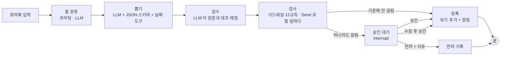

# 설계 초안 — 회의록 할 일 자동 등록 (사람 승인 포함)

> 3단계 산출물. **측정 전에** 정해 두는 문서다. 측정 결과를 보고 기준을 고치지 않는다 (전역 규칙 16).
> 확정되면 REPORT.md 의 「파이프라인 구조도」 · 「승인 기준과 그 이유」 로 옮긴다. 이 파일은 제출물이 아니다.
> 상태: **확정** (2026-09-28 · 기준 6묶음 12규칙 · 배경 「다」 시니어 AI 교육 · 비교표 유지 · k = 10 · D 보완 · 경상도 사투리 1명)

---

## 1. 무엇을 자동화하나 · 어디서 바깥으로 나가나

회의록 한 편을 넣으면 LLM 이 할 일을 뽑아 **업무 보드에 등록하고 담당자에게 알림**을 보낸다.

- **바깥으로 나가는 단계 = 등록 + 알림.** 알림을 받은 담당자는 그 할 일을 하기 시작한다.
  보드 항목은 지울 수 있어도 **이미 간 알림은 되돌릴 수 없다** (엉뚱한 사람 · 틀린 마감으로 일이 시작됨)
- 업무 보드 · 알림은 실제 서비스 대신 **로컬 SQLite 표로 흉내** 낸다 (`board` · `outbox`)
- 그래서 HITL 자리는 **등록 바로 앞**. 뽑기 · 검사는 틀려도 다시 하면 된다

## 2-0. 쓰는 디자인 패턴 (09-28 확정 · LMS 노드 목록과 대조 · 원문 「이번 모듈의 디자인 패턴을 활용하여」)

LMS 모듈 노드: 1 LangGraph 워크플로 설계 · 2 뉴스레터(수집부터 발행) · 3 [프로젝트] · 4 고객 응대(**라우팅과 그라운딩**) · 5 [프로젝트] ·
6 영화 추천(GraphRAG) · 7 [프로젝트] · 8 딥리서치(오케스트레이션) · 9 [프로젝트] · 10 사람이 승인하는 에이전트 [프로젝트]

| 노드 | 패턴 | 회의록에서 하는 일 |
|---|---|---|
| 1 | 워크플로 설계 (상태 그래프 · 조건부 분기) | 뼈대. 「기준에 걸림 / 안 걸림」 · 「승인 / 반려」 분기 |
| 2 | 단계 연결 + 자동 검수 + 발행 | 분류 → 뽑기 → **검수 LLM 이 원문과 대조해 채점** → 등록(= 발행 · HITL 자리) |
| 2 | `Send` 병렬 | 할 일마다 가드레일 검사를 동시에 |
| 4 | 라우팅 | 줄마다 할 일 / 끝난 일 / 미확정 / 조건부 / 잡담 → 함정 줄을 거름 |
| 4 | **그라운딩** | 할 일은 회의록 원문 근거 줄로만 뽑고 근거 줄을 붙임 → 검수 · 기준 D · 승인 화면 「근거 원문」 이 이것을 확인 |
| 10 | HITL | `interrupt` · `SqliteSaver` · `Command(resume)` |
| 모듈 밖 | 도구 호출 (harness · 고객 응대 조회 도구) | 「이번 주 금요일」 → LLM 이 **스스로** 날짜 계산 도구를 부름. 안 부르고 직접 쓴 횟수도 센다 |

- **뺀 것과 이유**: 6 GraphRAG — 회의록에 그래프로 엮을 지식이 없음 / 8 오케스트레이션 — 회의록 한 편이 20줄 안팎이라 나눠 맡길 거리가 없음 /
  반성(모듈 밖) — 모듈 패턴에 집중. 검수에서 걸린 건은 HITL 로 보낸다 (REPORT 회고에 적음)
- 09-28 처음 정리에서 그라운딩을 빠뜨리고, 모듈 밖 패턴을 모듈 것이라 적었던 것을 노드 목록으로 바로잡음
- 검수 점수를 멈춤 기준(묶음 G)으로 쓸지와 기준값은 **측정 전에** 정한다 (5단계 코드 전에 확인)
- 비용: 회의록 한 편에 호출 약 3~4회 → 6편 × 2회차 ≈ 0.05달러 (추정) · 상한 2달러

## 2. 파이프라인

- **그래프 두 개 (09-28 작성자 확정)**: ① 회의록 그래프 (thread = 회의록 id) — 분류 · 뽑기 · 검수 · 가드레일(`Send`) 후 끝 /
  ② 할 일 그래프 (**thread = 할 일 id**) — 걸림 없음 → 등록 / 걸림 → `interrupt` → 재개 → 등록 · 반려. 수업 실습의 R3 한 건 = 할 일 한 건.
  이유: 한 그래프면 갈래 하나가 멈출 때 자동 처리 건의 등록까지 멈춘다 — **시험으로 확인 (09-28, langgraph 1.2.12,
  `tests/test_langgraph_behavior.py`)**: Send 세 갈래 중 B 만 멈추자 A · C 의 등록도 B 재개 뒤에야 실행됨.
  같은 시험에서 재개 때 멈춘 단계(B 검사)만 처음부터 다시 돌고 A · C 는 안 돎 / SqliteSaver 로 다른 프로세스에서 재개 성공 ·
  멈춘 노드 몸통 2번 실행 · 앞 단계 1번 · 등록 1번
- **단위**: 회의록 한 편 = 분류 · 뽑기 · 검수. 뽑힌 **할 일 한 건 = `thread_id` 하나** (`회의록id-번호`).
  그래야 한 건이 대기 중이어도 나머지는 자동으로 끝난다
- **`승인 대기` 노드에는 `interrupt` 만 둔다.** 알림 · 등록은 `등록` 노드에만 있다.
  (수업: 이어갈 때 멈춘 단계를 첫 줄부터 다시 실행 → 묻기 전에 바깥으로 나가는 동작 금지)
- **체크포인터 = `SqliteSaver`** (파일). 껐다 켜도 대기 건이 남아야 한다 (필수 구현 1 「나중에 확인하더라도」)
- 대기 목록 = 체크포인트의 「다음 단계」 가 `승인 대기` 로 남아 있는 thread (수업: 다음 단계가 비면 끝)
- 응답: 승인 · 수정 후 승인(담당자 · 마감 · 내용 고치기) · 반려(사유 필수). 「다시 판정」 은 원문 필수가 아니라 뺀다
- 대기 시한 규칙 (후보): 3일 지나면 **자동 반려 + 회의 주최자에게 알림**. 자동 승인은 하지 않는다 (놓침이 더 비싸서)

## 3. 할 일 한 건의 형식 (LLM 이 내놓는 것)

| 칸 | 뜻 | 예 |
|---|---|---|
| `내용` | 할 일 | 「견적서 수정본 보내기」 |
| `담당자` | 회의록에 적힌 이름 그대로. 없으면 `null` | 「민지」 |
| `마감_원문` | 회의록에 나온 표현 그대로. 없으면 `null` | 「금요일까지」 · 「다음 주쯤」 |
| `마감` | 날짜로 확정할 수 있을 때만 `YYYY-MM-DD`, 아니면 `null` | 「2026-10-02」 |
| `근거` | 회의록에서 **그대로 복사한** 문장 | 「민지 씨가 금요일까지 견적서 수정본 보내 주세요.」 |

회의록마다 머리에 `회의일` · `참석자` 명단을 둔다 (기준 계산에 필요).

## 4. 멈춤 기준 — 6묶음 · 세부 규칙 12개 · 모두 계산 가능

비교는 **묶음 단위**, 승인 화면 · 비교표의 「걸린 이유」 는 **세부 규칙 번호**로 보여 준다 (09-28 작성자 결정 「가」).

| 묶음 | 세부 규칙 (계산 방법) | 막으려는 위험 |
|---|---|---|
| **A 담당자 불분명** | ① `담당자` 가 `null` · ② 참석자 명단에 없음 · ③ 「다 같이 · 우리 팀 · 누가」 같은 여럿 · 미정 표현 | 아무도 안 하는 할 일 · 엉뚱한 사람에게 알림 |
| **B 마감 임박** | ④ `0 ≤ 마감 − 회의일 ≤ 3일` (원문 예시) | 틀리게 등록되면 바로잡을 시간이 없음 |
| **C 마감 불확실** | ⑤ `마감_원문` 은 있는데 `마감` 이 `null` · ⑥ 「쯤 · 조만간 · 가능하면 · 빨리」 · ⑩ `마감 < 회의일` | LLM 이 날짜를 지어내거나 잘못 계산해 틀린 마감이 나감 |
| **D 근거 불일치** | ⑦ `근거` 가 회의록 원문에 (공백 정리 후) 그대로 없음 · ⑧ `담당자` 이름이 `근거` 에 없음 | 회의에서 하지 않은 말을 할 일로 만듦 (지어냄) |
| **E 미확정 논의** | ⑨ 「검토해 보자 · 일단 · 아직 · 보류 · 다음에 다시」 · ⑪ 조건부 「~되면 · ~하면 · 확정되면」 | 결정되지 않은 이야기를 확정된 할 일처럼 등록 |
| **F 바깥 연락** | ⑫ `내용` 에 「고객 · 거래처 · 외부 · 발송 · 전화 · 메일 보내」 | 할 일 자체가 회사 밖 사람에게 닿음 — 틀리면 알림보다 더 큰 사고 |
| **G 검수 불합격** (09-28 추가 · 「가」) | ⑬ 검수 LLM 의 네 질문 중 「아니오」 가 하나라도 있음: ① 담당자가 근거 줄 · **참석자 역할**과 맞나 ② 마감이 근거 표현과 맞나 ③ 근거 줄에 이 할 일이 있나 ④ 확정된 할 일인가 (끝난 일 · 다음 기수 · 제안 · 조건 미충족 아님) | 규칙(A~F)이 글자로는 못 잡는 착오 — 말한 사람 ≠ 담당자(M5-01) · 끝난 일 · 제안 |

| **H 뽑기 누락 의심** (09-28 M1 시운전 뒤 추가) | ⑭ 줄 분류는 「할일 · 조건부」 인데 뽑힌 할 일 어느 근거에도 **글자 그대로** 없는 줄 → 「할 일 후보」 로 만들어 무조건 승인 대기 (LLM 없음) | 두 LLM 단계가 엇갈려 할 일이 등록도 대기도 없이 **조용히 빠지는** 것 (누락은 HITL 이 막을 기회조차 없음) |

- H 채점: 후보가 아직 짝 없는 정답 건과 근거가 겹치면 **누락을 되찾음**(봐야함 예), 아니면 **헛멈춤**(봐야함 아니오).
  H 가 없는 구성은 후보가 없는 것으로 보고 누락을 「H 없이」 로 센다. **비용 = (놓침 + 누락) × 10 + 헛멈춤** —
  누락은 사람에게도 보드에도 안 나타나는 놓침이라 같은 무게 (H 를 더하며 바꿈 · 측정 전)
- G 를 「확신도 0.7 미만」(원문 주제 예시 모양 · 안 「나」) 대신 네 질문(안 「가」)으로 한 이유: 0.7 이라는 값을 설명할 근거가 없고
  (데이터로 맞추면 측정 뒤 기준 수정), LLM 이 스스로 매긴 점수는 높은 쪽에 몰리는 경향. 네 질문은 정할 값이 없고
  질문마다 막는 위험이 따로 있어 승인 화면의 「멈춘 이유」 로 바로 쓸 수 있다 (09-28 작성자 결정 · 역할 포함)

- **측정 전 표현 규칙 점검 (09-28 · 회의록 6편 81줄 · 걸린 곳 29 + 내용 2)** — 결정은 작성자
  - 🔧 **고침 (구현 결함)**: E11 「하면」 이 「작업**하면서** · 수업**하면서**」(하는 동안)에 걸림 → 「하면 · 되면」 뒤에 「서」 가 붙으면 안 셈. 단어 목록은 그대로
  - ⚠️ **그대로 둠 (단어 뜻이 여러 가지 = 글자 맞추기의 한계)**: E9 「**아직** 못 드렸어요」(늦어짐, 할 일은 확정) ·
    E11 「제가 **하면** 되죠?」(맡겠다는 확인) · A3 「화면 캡처는 **누가** 찍어요?」(다음 줄에서 정해짐)
    → 측정에서 헛멈춤으로 드러나면 REPORT 3 · 6 에 「규칙의 한계 → 검수가 필요한 이유」 로 적는다
  - 사투리(퍼뜩 · 넘으믄 · 생각해 보입시더 · 함 여쭤 보께예)는 하나도 안 걸림 — 측정 전 결정대로 고치지 않는다
- 원문 예시(「담당자 불분명 · 마감 3일 이내」) = **A + B**. 이것을 **기준선**으로 두고 C · D · E · F 를 하나씩 더해 비교한다
- 성격: A · B 는 **칸 값** 검사, C · E · F 는 **표현** 검사, D 는 **원문 대조** 검사 → 걸리는 이유가 서로 다르다
- 주의 (측정 전에 적어 둠): ⑪ 「~하면」 · ⑫ 「메일」 같은 표현 검사는 **헛멈춤을 많이 낼 수 있다.**
  1인기업 회의는 고객 연락 할 일이 많아서 F 가 개입률을 크게 올릴 수 있다 → 비교표로 확인
- 자동 처리되는 건 = 담당자가 참석자 중 한 명으로 분명하고 · 마감이 4일 이상 남은 확정 날짜이고 · 근거가 원문에 그대로 있고 ·
  확정된 결정이고 · 회사 안에서 끝나는 할 일. **이 건이 사람 없이 나가도 괜찮은 이유**는 비교표의 「자동 처리된 건 중 놓침」 으로 보인다

## 5. 정답 붙이는 법 (측정 도구)

- 할 일마다 **「사람이 봐야 하나 (예 / 아니오)」 + 이유 한 줄**. 질문은 하나로 고정:
  **「이 할 일이 그대로 등록되고 알림이 가면 문제가 생기나?」**
- **정답은 기준 표를 보지 않고 붙인다.** 「A 에 걸리니까 예」 로 붙이면 기준을 기준으로 채점하는 셈이 된다
- 회의록마다 **정답 할 일 목록**(근거 문장 포함)을 먼저 적어 둔다. LLM 이 뽑은 건은 근거 문장이 겹치는 정답 건과 짝짓는다
  - 짝이 없는 뽑힌 건 = **지어낸 할 일** → 정답은 자동으로 「예」
  - 짝이 없는 정답 건 = **뽑기 누락** → HITL 이 잡을 수 없는 문제. 비교표와 따로 센다 (REPORT 에 한계로 적음)
- 짝짓기 · 채점 코드는 **먼저 검증**: 정답 목록을 그대로 넣으면 누락 0 · 지어냄 0 이 나오는지,
  일부러 틀린 목록(한 건 빼기 · 한 건 지어내기)을 넣으면 그만큼 잡히는지

## 6. 비교할 구성 · 세는 값

> **09-28 정리**: 아래 9줄 대신 REPORT 에는 **4줄**(기준 없음 · 원문 예시 A+B · 최종 A~H · 전부 멈춤) +
> 「묶음 단독」 · 「하나씩 빼기」 표로 묶음마다의 몫을 보인다 (작성자: 완성도에 집중). 고르는 점수는 「손실 점수」

| 구성 | 기준 |
|---|---|
| 0 | 기준 없음 (전부 자동) |
| 1 | A |
| 2 | **A + B (원문 예시 · 기준선)** |
| 3 | A + B + C |
| 4 | A + B + C + D |
| 5 | A + B + C + D + E |
| 6 | A + B + C + D + E + F |
| 7 | A ~ F + G (검수) |
| 8 | A ~ G + H (누락 의심) |
| 9 | 전부 멈춤 (H 없음 · 기준점) |

- 하나씩 더해 가는 순서라 **앞 묶음이 이미 잡은 건은 뒤 묶음의 효과로 안 보인다.** 그래서 묶음마다 「혼자 켰을 때 잡는 건수」 도 따로 센다
  (예: F 가 잡는 건이 전부 A 도 잡는 건이면, F 는 더해도 놓침이 안 줄고 헛멈춤만 늘 수 있다)

세는 값 (수업 그대로): **개입률**(멈춘 건 / 전체) · **놓침**(봐야 하는데 자동으로 나감) · **헛멈춤**(안 봐도 되는데 멈춤).
뽑기는 LLM 이라 같은 회의록도 결과가 조금 다를 수 있다 → **뽑기를 두 번 돌려** 두 회차 모두에서 센다.

## 7. 고르는 법 — 측정 전에 확정

원문 · 강의에 없는 임의 수치(개입률 상한 등)는 두지 않는다 (09-28 작성자 「실제 과제 중심」).
강의 그대로: **「놓침과 헛멈춤 중 어느 쪽이 더 비싼지를 따져 고른다」**.

1. **이 업무에서 더 비싼 쪽 (측정 전 판단)**: 놓침.
   틀린 할 일의 알림은 되돌릴 수 없다 (엉뚱한 사람 · 틀린 마감으로 일이 시작되고, F 는 회사 밖까지 닿는다).
   헛멈춤은 담당자가 한 건을 확인하는 시간(강의 목표 10초)이다
2. 「기준 없음」 · 「전부 멈춤」 은 **비교용 기준점**이다. 채택 후보가 아니다 (전부 멈춤은 놓침 0 이지만 자동화가 아니다)
3. 계산 방법: **비용 = 놓침 × 10 + 헛멈춤 → 가장 작은 구성** (k = 10, 09-28 작성자).
   이유: 「틀린 알림은 수습이 오래 걸린다」 — 정정 연락 · 혼선 수습에 몇 분, 헛멈춤 한 건은 확인 10초
4. 두 회차(뽑기 2번) 합계로 계산한다. 동률이면 묶음 수가 적은 쪽
5. 이 판단은 **데이터를 보기 전에** 정한 것이다. 측정 후에 바꾸지 않는다

> k 를 둔 이유: 「놓침 최소」 하나로만 고르면 멈추는 기준이 많을수록 늘 이긴다 (전부 멈춤에 가까워짐).
> 강의의 「어느 쪽이 더 비싼지 따진다」 를 계산하려면 **놓침 1건이 헛멈춤 몇 건과 같은지** 를 정해야 한다

## 8. 자료 계획 (4단계)

- 회의록 **6편** (Claude 초안 4 · **작성자 2편은 실제 말투로**). 한 편에 할 일 6~10개 → 전체 40~50건 목표
- 배경 (09-28 작성자 「다」): **1인기업 대표 + 외주 협력자 2~3명의 프로젝트 회의** (가상 인물. 동료 실명 · 실제 회사 없음).
  담당자가 여럿이라 A 가 살아나고, 외부 연락(F)이 적당히 섞인다
- 업무 (09-28 작성자 「2번」 · 이유 「내 도메인을 일정하게 유지」): **시니어 AI 활용 교육 프로그램 운영**
  - 인물: 대표(강사) · 외주 교안 디자이너 · 외주 영상 편집자 · 복지관 담당자(바깥 사람). 모두 가상 이름
  - 회의 6편이 한 프로그램의 진행 순서대로 이어진다 (기획 → 교안 · 영상 → 모집 → 개강 전 → 운영 중 → 마무리)
  - 약점: 할 일이 단순해 D(근거 불일치)가 나올 거리가 적을 수 있음 → 회의록에 **말이 바뀌는 대목**
    (「A 씨가 하기로 했다가 B 씨로 바꿈」 · 「날짜를 두 번 고침」)을 넣어 LLM 이 헷갈릴 자리를 만든다
- 섞을 것: 분명한 할 일(자동 대상) · 담당자 없음 · 참석자 아닌 사람 · 임박 · 「다음 주쯤」 · 「검토해 보자」 ·
  「계약되면」 같은 조건부 · 고객 · 거래처 연락 · 회의일보다 이른 날짜(「지난 금요일까지였던 것」) ·
  **같은 할 일을 표현만 바꿔 두 번 말함** · 농담이나 잡담 속 「해야지」
- **회의록 형식**: 「말한 사람: 말」 한 줄씩. 근거는 **그 줄을 통째로** 따온다
  (「지수: 제가 할게요」 에서 근거를 「제가 할게요」 만 따오면 맞는 답인데도 ⑧ 이 걸리는 구멍을 막음)
- **D 보완 — 헷갈리는 대목 6가지를 심는다** (작성자 지적: 할 일이 단순하면 D 거리가 적음)

  | 대목 | 예 | LLM 이 틀리는 방식 |
  |---|---|---|
  | 말 바꾸기 | 「교안은 지수 씨가… 아니다, 민호 씨가」 | 먼저 나온 사람으로 등록 |
  | 나눠서 말함 | 「안내 문자 돌려야죠」 … 두 줄 뒤 「그거 제가 할게요」 | 두 줄을 합쳐 없는 문장을 만듦 |
  | 지시어 | 「지난번 그 건 제가 마무리할게요」 | 「그 건」 을 짐작으로 채움 |
  | 거절된 제안 | 「제가 전화할까요?」 「아뇨, 제가 할게요」 | 거절된 쪽으로 등록 |
  | 이미 끝난 일 | 「현수막은 어제 주문했어요」 | 끝난 일을 할 일로 등록 |
  | 전해 들은 말 | 「관장님이 동의서 받으라 하셨대요」 | 관장님을 담당자로 등록 |

- **사투리 (09-28 작성자 · 경상도)**: 복지관 담당자 **한 명만** 경상도 말. 대표 · 외주는 표준어
  - 사투리로 말한 할 일 중 **3~4건은 표준어 짝**을 다른 회의에 넣는다 → 사투리 효과만 따로 비교
  - 규칙 키워드는 **표준어 그대로** (측정 전 확정). 결과를 보고 사투리 단어를 추가하지 않는다 → 회고의 「보완하고 싶은 점」
  - 예상 (측정 전 적어 둠): ⑥ ⑨ ⑪ 표현 검사가 「퍼뜩 · 되믄 · 함 보입시더」 를 못 잡아 **놓침** /
    LLM 이 근거를 표준어로 고쳐 옮겨 ⑦ 이 걸림 (내용이 맞으면 **헛멈춤**)
  - Claude 초안의 사투리는 가볍게. **작성자 M5 · M6 은 편한 말투 그대로**
- **D 검사 코드 검증**: LLM 이 실제로 안 틀려도, 일부러 만든 오답(근거 바꾸기 · 담당자 바꾸기 · 없는 할 일)을 넣어 잡히는지 먼저 확인.
  실제 측정에서 D 가 적게 걸리면 「이번 자료에서 n건 — 효과 단정 어려움」 으로 그대로 적는다
- **세부 규칙마다 걸리는 사례가 최소 2건**은 들어가게 초안을 짠다 (0건이면 그 규칙의 효과를 말할 수 없음).
  단, 정답(봐야 하나)은 규칙과 무관하게 「문제가 생기나」 로만 붙인다
- 정답은 작성자가 확정 (초안은 Claude)

## 8-1. M1 시운전 (09-28) — 찾은 결함과 공정성 처리

첫 실제 실행(M1 · 0.00136달러): 정답 9건 중 **누락 4건** (라우팅이 「~할게요 · ~께예」 수락 · 미래형을 끝난 일로 보고 버림,
사투리 두 줄 모두) · 검수 ② 를 「마감이 없으면 틀림」 으로 읽어 G13 헛멈춤 · 채점기가 담당자가 틀린 건을 다른 정답과 짝지어 정상으로 셈.

| # | 고친 것 | 기준(13규칙) |
|---|---|---|
| 1 | 라우팅은 **줄을 버리지 않고 표시만** (잡담뿐이면 건너뜀). 분류 · 뽑기 지시문에 일반 원칙 추가: 대답 · 수락 · 사투리 미래형은 할 일, 끝난 일은 과거형만. **M1 문장은 넣지 않음** | 안 바뀜 |
| 2 | 검수 ② 문장: 「근거에 마감 표현이 없고 마감도 비어 있으면 맞다」 | 뜻 같음 · 문장만 분명히 |
| 3 | 채점기 짝짓기: 내용이 비슷한 정답 건 먼저, 담당자는 동점일 때만 (검증에 시운전 사례 추가) | 측정 도구 결함 |
| 4 | 시운전 2회차(0.00145달러): 분류는 바로잡혔지만 뽑기가 3건을 빠뜨림 (분류 = 할일인데 뽑기 없음). 지시문을 더 고치지 않고 **기준 H14** 로 사람에게 보이게 함 | **추가** (H14) |

- **공정성**: 1 · 2 는 M1 결과를 보고 고쳤으므로 **M1 은 시운전용**. REPORT 에 사실대로 적고,
  비교표는 **6편 전체** 와 **M1 을 뺀 5편**(고칠 때 보지 않은 자료) 두 가지로 낸다 (09-28 작성자 확정)

## 8-2. 모델 (09-28)

- 예산이 풀려(상한 5달러) 더 좋은 모델을 검토: 공식 가격표 확인 → 작성자가 `gpt-5.6-luna` 선택 (이 키로 써 본 모델)
- 모델 목록 조회로 사용 가능 확인 · 온도 0 을 받는 것 확인 · 줄 분류(구조화 출력)는 됨
- **뽑기(날짜 도구 호출)에서 400 오류**: chat completions 에서 「추론 설정과 함수 도구를 함께 쓸 수 없다」
  (routing-agent REPORT 에 적어 둔 것과 같은 제약). 쓴 돈 0.00095달러 · 남은 결과 파일 없음
- **결정: `gpt-4o-mini` 유지** (시운전 두 번에서 날짜 도구 호출까지 문제없음). REPORT 1 · 6 에 이 경과를 적는다

## 8-3. 측정 결과와 최종 구성 결정 (09-28 · gpt-4o-mini · 6편 × 2회 · 0.0186달러)

| 구성 (6편 · 두 회차 합) | 전체 | 멈춤 | 놓침 | 누락 | 헛멈춤 | 손실 |
|---|---|---|---|---|---|---|
| 기준 없음 | 88 | 0 | 31 | 28 | 0 | 590 |
| 원문 예시 A+B | 88 | 16 | 29 | 28 | 14 | 584 |
| **최종 A~H** | 125 | 92 | 7 | 9 | 49 | **209** |
| 전부 멈춤 (H 없음) | 88 | 88 | 0 | 28 | 57 | 337 |

(정답 M5-03 을 바로잡은 뒤 다시 채점한 값. 바로잡기 전: 600 · 594 · 219 · 336)
- M1 을 뺀 5편도 같은 순서 (530 · 520 · **175** · 265). 회차 1 → 2 흔들림: 최종 약 13점
- 하나씩 빼기: H 381 · G 251 · C 239 · D 229 · E 227 · B 219 · A 209 · F **207**
- **최종 = A~H 그대로 (작성자 「가」)**. F 뺌이 2점(회차마다 1점) 낮지만 흔들림 13점 안의 차이라 근거가 못 됨 (16번 규칙).
  F 는 혼자 잡은 「봐야 할 건」 0 · 혼자 만든 헛멈춤 M4-06 (회차마다 1). A 는 실제 뽑힌 할 일에 한 번도 안 걸림 —
  LLM 이 담당자를 비운 적이 없고 불참자 담당 할 일은 아예 누락됨 → **「이번 자료에서는 몫이 확인되지 않음」 으로 REPORT 에 적는다**
- **틀린 건 원인 — 작성자가 원문을 읽고 확정 (09-28)**: M5-01 「말한 사람(도윤) ≠ 담당자(지수)」 맞음 ·
  M5-03 은 **지수가 자기 역할(교안)로 맡겠다는 뜻** → 에이전트가 맞았고 **정답이 틀렸음** → 정답 1건 수정 (담당 지수 · 봐야함 아니오).
  측정 **뒤에** 정답을 고친 것이므로 REPORT 에 「원문 읽기에서 정답 1건을 작성자가 바로잡음」 으로 적는다 (기준은 안 바꿈) ·
  M2-05 「올릴 낍니더」 는 **할 일 맞음** (사투리를 할 일로 못 본 누락).
  나머지 원인(M6-03 부탁한 사람을 담당자로 · M5-09 마감 빠짐 · M2-04 · M6-01 중복 · M2-09 · M6-04 누락)은 Claude 초안

## 8-4. 원인 다시 보기와 해결 순서 (09-28 밤 · 작성자와 하나씩 확인)

- 판단: Main Quest 05 목표 중 「패턴 · 도메인 · 내보내기 전 승인」 은 적용, **「위험한 건에서만 멈추고 왜 맞는지 설명」 은 미적용**
  (멈춤 74% · 헛멈춤이 멈춘 건의 53% · 자동 처리 33건 중 놓침 7)
- 원인 한 표 (원본으로 확인): R1 분류가 할 일을 버림(누락 7) · R2 말한 사람 = 담당자 가정(놓침 3 · 헛 1) · R3 마감 처리가 날짜 도구와 따로 놂
  (놓침 3 · 헛 4 · **날짜 도구가 「금요일까지요」 · 「오늘 보낼게요」 를 못 읽음 — 검증 자료가 LLM 실제 입력을 대표하지 못함**) · R4 중복(놓침 2) ·
  R5 한 줄 두 할 일(누락 2) · R6 H14 글자 판정(헛 13) · R7 B4 급함만(헛 13) · R8 검수 ④ 뜻 섞임(헛 14) · R9 표현 단어 뜻(헛 4) ·
  R10 F 가 관문과 안 맞음(헛 2) · R11 채점 · 정답
- 방향 (작성자 확인): **LLM 을 고치는 것이 아니라 기준을 고치고 더해서** 「위험한 건에서만 멈추고, 틀린 건은 잡게」. 커리큘럼 3 「헛멈춤이 많으면 버튼만 누른다」 를 채우는 일
- 순서: 1 측정 도구(R11) → 2 기준이 위험을 정확히 보게(R3ⓒ · R6 · R7 · R8 · R9 · R10) → 3 틀린 것을 잡는 기준(R1ⓐ · R2 · R3ⓐⓑ · R4) →
  4 반려 뒤 처리(버리나 · 담당자에게 넘기나) → 5 한 번도 안 본 회의록으로 전후 비교 → 6 REPORT · README · 새 클론 · 제출
- **1 측정 도구 결정 (작성자)**: ⓐ-1 근거가 원문에 그대로 없으면 어긋남(근거) · ⓑ-1 같은 일 두 건 = 중복 그대로 ·
  ⓒ-3 마감이 빠진 5건(M3-09 · M4-04 · M5-09 · M2-03 · M4-10) 모두 「문제 있음」 → 정답 그대로
- **고치기 전 기준선 (새 채점 · 6편 · 두 회차 합)**: 기준 없음 600 · 원문 예시 A+B 583 · **최종 A~H 208 (멈춤 92/125 · 놓침 7 · 누락 9 · 헛멈춤 48)** · 전부 멈춤 336

## 8-5. 해결 2단계 결정 — 기준이 위험을 정확히 보게 (09-28 밤 · 작성자와 하나씩 · 코드는 아직)

| 뿌리 | 결정 | 원본에서 확인한 근거 |
|---|---|---|
| R6 H14 글자 판정 | **C**: 빠진 줄만 LLM 에 대조 (같은 일 / 새 할 일 / 할 일 아님). 「할 일 아님」 은 C-1 버림 · C-2 남김 **둘 다 재서 고름** | 헛 13 = 두 줄 할 일의 나머지 줄 (부탁 줄 9 · 지시 2 · 거절된 제안 1 · 근거를 고쳐 적음 1) |
| R7 B4 급함만 | **2-가 급한 건 재확인(코드)**: B4 만 걸리면 「마감이 날짜 도구가 준 날짜 · 마감 표현이 근거에 있음 · 담당자가 참석자」 이면 자동. 작성자 업무 판단: 급해도 맞게 뽑혔으면 보내도 됨 | B4 16건 중 막으려던 위험(틀린 채 급하게)에 해당 0. 시험: 헛 −9 · 단 B4 가 우연히 잡던 **M3-02 중복 2건이 풀림** |
| R4 중복 (R7 과 함께) | **R4-마**: 같은 담당자 할 일 쌍을 LLM 에 「같은 일인가」 → 같으면 멈춤. **C 와 한 「대조」 노드** (회의록마다 LLM 1회) | 중복 7건 모두 근거 줄 겹침 **0** (처음 제안 「근거 겹침」 은 틀려서 버림). 코드 규칙: 같은 날짜 3/7 잡고 헛 3 · 없음 포함 7/7 잡고 헛 21 |
| R8 검수 ④ 뜻 섞임 | **3-가 + 3-나 + 3-라**: ④ 를 네 질문(끝난 일 · 다음 기수 · 제안만 · 조건 미충족)으로 · 「아니오 이유가 아닌 것」(마감 없음 · 조심스러운 말투 · 순서상 뒤 · 아직 안 함 · 원래 마감 지남) 명시 · **아니오에는 근거 표현을 인용, 코드가 근거 줄에 있는지 확인** | 헛 16 중 14 가 ④. 이유가 근거 줄에 없는 오해 대부분. **M6-03(G 만 잡음 · 이유 틀림)은 ④ 를 고치면 풀릴 수 있음 → R2 에서 함께** |
| R3ⓒ C 가 안전한 건 | **C5**: 날짜 도구가 「원래 모호함」 이라 한 표현은 뺌 · **C6**: 모호 표현은 마감 표현 칸에서 보고 **마감에 날짜가 있을 때만**(지어냄) · **C12 추가**: LLM 이 도구 없이 날짜를 직접 씀 · **날짜 도구 고치기**: 끝 「요」 · 동사 떼기, 회의록 머리의 개강일로 「개강 날 · 개강 전날」 (검증 자료는 LLM 이 실제로 넘긴 표현으로) | 도구 풀이가 「원래 모호」 → 헛 4 / 「못 읽음 · 기준 필요」 → 맞게 8 로 예외 없이 갈림. 도구를 고치면 뽑기부터 다시 재야 함 |
| R9 표현 단어 뜻 | **9-다**: 뜻이 분명한 표현(확정되면 · 되면 · 보류 · 다음에 다시 · 검토해 보자) → 바로 멈춤 / 뜻이 여러 가지(하면 · 아직 · 일단 · 가능하면) → 검수 ④ 에 신호로 | 「아직 못 드렸어요」 · 「가능하면」 헛 4 (측정 전 예상 그대로). E 만 잡은 건은 **M2-02 중복 2건을 「하면 되죠?」 로 우연히** → R4-마가 대신 잡는지 측정 때 꼭 확인 |
| R10 F 관문과 안 맞음 | **F 유지** (작성자 업무 판단: 바깥 연락 할 일은 맞아도 대표가 본다). **①-가** 채점에 「의도한 멈춤」 칸: 봐야함 아니오인데 F 로만 멈춘 건은 헛멈춤 아님 · 손실에 안 넣고 멈춤 건수엔 셈. **②-가** 뽑기가 할 일마다 「연락 대상」(없음 · 팀 · 바깥) 칸을 내고 근거에서 인용 → F 는 그 칸을 봄. **바깥 사람 = (가)**: 팀은 도윤 · 지수 · 민호, 바깥은 영숙(복지관) · 수강생 · 관장님 · 복지관 전산 담당 · 시설팀 · 인쇄소 등 | F 만 잡은 봐야 할 건 0 · 헛 2(M4-06). 단어 목록은 「문자 · 안내 · 올리기 · 여쭙기」 를 못 찾음 (M3-05 · M5-11 · M1-09 · M3-06) |

- 공통 원리 (REPORT 3 에 쓸 문장 후보): **신호에 걸리면 바로 멈추지 않고 한 번 더 확인한다** (B4 → 코드 재확인, 뜻이 여러 가지인 E → 검수) · **판단에도 그라운딩** (검수의 아니오 · 연락 대상은 근거 줄 인용)
- 측정 방법에 미치는 영향: 날짜 도구 · 연락 대상 칸은 **뽑기부터 다시** 돌려야 함 (저장된 뽑기 위에서만 재기는 안 됨)

## 8-6. 해결 3단계 결정 · 근본 원리 · v2 구현 (09-28 밤 · 작성자 「응 그렇게 하고 구현 진행해」)

- **근본 원인 하나**: 기준이 LLM 이 낸 「값」 만 보고, 그 값이 원문 어디서 나왔는지는 모름 → 값이 그럴듯하게 틀리면 속고, 맞아도 단어가 겹치면 괜히 멈춤
- **근본 원리**: 값마다 근거를 붙이고(인용) · 코드가 확인하고 · 애매하면 LLM 이 원문과 대조한다. 신호는 바로 멈추지 않고 확인을 부른다. 확인의 아니오도 인용해야 인정

| 뿌리 | 결정 | 구현 |
|---|---|---|
| R1 분류가 할 일을 버림 (+R5 한 줄 두 할 일) | **1-나**: 어느 근거에도 없는 줄은 잡담만 빼고 모두 대조로 · 한 줄에서 할 일 여러 개 | 대조 노드 `lines` · `new_tasks` |
| R2 말한 사람 = 담당자 | **2-라** 부탁하는 말(주세요 · 주이소 · 부탁해요 · 부탁드려요 · 해 주시고)인데 담당자 = 말한 사람 → **A4** · **2-마** D8: 부탁 줄이고 담당자가 바로 앞 줄 화자면 면제 · **2-바** 검수 ① 에 「부탁 → 부탁받은 사람, 제가 → 말한 사람, 불참자는 이미 맡기로 했다는 말」 | M5-01(글로는 판단 불가) · M4-01(동의 여부)은 **REPORT 한계** |
| R3ⓐ 마감 표현 놓침 | **3a-다** 기본: 근거에 날짜 표현 · 마감 비움 → 검수 ② 에 신호 · **3a-가** 코드 규칙 C13 은 **비교용**으로 함께 잼 | `비교용규칙` · 걸린규칙 / 비교규칙 칸 분리 (그래프 ② 는 C13 만으로 멈추지 않음) |
| 반려 뒤 | 등록하지 않고 사유만 기록 · ④ 결과에 「반려 사유 모음」(멈춘 규칙 + 사유). 담당자에게 넘기지 않음 | `/api/results` 반려모음 |
| 수아 · 태호 | 팀 (외주와 같음). 영향은 F 의 M1-08 한 건뿐 | `meeting.팀` |

- **v2 그래프 ①**: 분류 → 뽑기 ⇄ 날짜도구 → **정리**(코드: 직접 쓴 날짜 · 마감 종류) → **대조**(LLM: 빠진 줄 · 같은 담당자 쌍) → **검수 v2**(LLM: ①②③ + ④ 넷 · 인용 · 신호) → 가드레일(Send)
- **v2 규칙**: A1 A2 A3 **A4** · B4′ · C5′ C6′ C10 **C12** (C13 비교용) · D7 D8′ · E9′ E11′ · F12′(연락대상 칸 · 업무 정책) · G13′(인용 확인) · H14(대조 후보) · **I15**(중복). 옛 규칙은 `agent/rules_v1.py`
- **채점기**: 의도한 멈춤(F12 만) 칸 · v1 / v2 같은 채점기 · C-1 / C-2 / C13 구성을 한 번 돌린 원본에서 함께 계산
- **기준선 다시 계산 (의도한 멈춤 반영)**: 최종 A~H **206** (208 에서 M4-06 두 회차 F12 만 2건이 의도한 멈춤으로) · M2~M6 172
- **측정 전 채택 기준 (먼저 적음 · 16번 규칙 · 09-28 밤 작성자 확정)**: v2 최종이 v1 최종보다 ① **놓침 + 누락이 늘지 않고** ② **손실 · 개입률(멈춤 ÷ 전체)이 줄면** 채택.
  손실 차이가 흔들림(회차 사이 약 13점)보다 작으면 「줄었다」 로 보지 않는다.
- **새 회의록**: M7 = 작성자 직접 (진짜 「안 본 자료」) · M8 = Claude 초안 → 작성자 확인. 정답도 같은 방식.
  M8 은 v2 측정 결과를 **보기 전에** 쓴다. 단 Claude 는 v1 실패 유형을 알고 v2 를 설계했으므로 M8 은 완전한 안 본 자료가 아님 → REPORT 에 적음
  6편(고칠 때 본 자료)과 **새 회의록(안 본 자료)** 양쪽에서 같은 방향이어야 함. 한쪽만 좋으면 채택하지 않고 원인을 읽는다.
  C-1 / C-2 · C13 은 같은 기준(손실 · 놓침 + 누락)으로 고른다. 측정 결과를 보고 기준을 바꾸지 않는다
- 비용 어림: 대조 호출이 회의록마다 1회 늘어 6편 × 2회 약 0.03~0.04달러 + 새 회의록 (상한 5달러 · 차단기)

## 8-7. v2 측정 결과 · 채택하지 않음 · v3 계획 (09-28 밤 · 작성자 「나」)

**v2 결과 (M1~M6 · 두 회차 합 · 같은 채점기)** — 기준선 v1 최종 A~H: 멈춤 92/125 (74%) · 놓침 7 · 누락 9 · 헛 46 · 손실 **206**

| v2 구성 | 멈춤 / 전체 | 놓침 | 누락 | 헛멈춤 | 손실 |
|---|---|---|---|---|---|
| 최종 A~I · C-2 남김 | 146 / 216 (68%) | 16 | 4 | 118 | 318 |
| 최종 A~I · C-1 버림 | 37 / 107 (35%) | 16 | 11 | 16 | 286 |
| 최종 A~I · C-2 + C13 | 148 / 216 (69%) | 14 | 4 | 118 | 298 |

→ 세 구성 모두 **놓침 + 누락이 늘고 손실도 늘어** 미리 정한 기준에 따라 **채택하지 않음**. 측정 비용 0.045달러 (M8 포함)

**원인 (원본에서 확인 · why_v2)**
1. 대조 LLM 이 빠진 줄을 잘못 가름: 「할 일 아님」 144 중 실제 할 일 13 · 「새 할 일」 5 모두 헛 → C-2 헛 +131 / C-1 누락 +7
2. **날짜 확인 구멍**: M4-03 「목요일까지」 에 다른 할 일의 도구 결과(금요일 10-30)를 가져다 씀 · M4-05 「낼까지」 → 11-03 도 같음. 코드는 「도구가 돌려준 날짜 중 하나인가」 만 봄 (놓침 4)
3. 인용 요구가 맞는 아니오를 버림: M2-08 담당자 없음을 맞게 답했으나 인용 「제가」 가 근거에 없어 불인정 — **없다는 문제는 인용할 말이 없음** (놓침 1)
4. ④ 를 넷으로 나누자 M6 다음 기수 제안 4건을 놓침 (v1 「확정된 할 일인가」 는 잡았음)
5. ② 신호를 넘겨도 검수가 무시 (M4-04 「개강 날」 · 놓침 2). v2 에서 C13 은 헛멈춤 없이 이 2건을 잡음
6. M3-02 중복 — v1 은 B4 가 우연히 잡았고 v2 대조는 같은 일로 못 봄 (놓침 1)
- 교훈 (REPORT 6 후보): **판단을 LLM 에 더 맡긴 곳(대조 · 검수 인용 · 신호)은 흔들렸고, 코드가 확인한 곳은 버텼다.** 2 는 코드 확인이 느슨해서 생긴 구멍

**v3 = 원인이 분명한 곳만 (측정 전 확정)**
| 부품 | v3 | 근거 |
|---|---|---|
| 뽑기 | v2 그대로 (담당 · 연락 인용 칸 · 부탁 규칙) | 뽑기만의 누락이 v1 28 → v2 19 로 줄어 해가 확인되지 않음 |
| 정리 · **C12′** | 마감 표현을 **코드가 날짜 도구로 다시 계산**해 마감과 다르면 멈춤 (+ 도구 없이 쓴 날짜) | 원인 2 — 값을 그 값의 근거와 맞춰 봄 (근본 원리 그대로) |
| 대조 | **같은 담당자 쌍의 중복(I15)만** LLM. 빠진 줄은 v1 H14 (분류 할일 · 조건부인데 근거에 없는 줄 → 후보 · 코드) | 원인 1 |
| 검수 | **v1 네 질문**(담당자 · 마감 · 근거 · 확정) · 아니오 하나면 G13 (인용 요구 없음) · 신호 없음. ① 질문에 2-바(부탁 → 부탁받은 사람) · 지시에 3-나(아니오 이유가 아닌 것) 는 넣음 | 원인 3 · 4 · 5. 2-바 · 3-나 는 실패 원인으로 확인되지 않음 |
| C13 | **기본으로 켬** | v2 측정 전에 정한 비교 (C-2 vs C-2 + C13) 의 결과: 놓침 −2 · 헛 +0 |
| 나머지 코드 규칙 | v2 그대로 (A4 · B4′ · C5′ · C6′ · D8′ · E′ · F′ · I15) | 실패 원인이 아님 · 단독 헛멈춤 작음 |

**판정 (측정 전 확정)**: v1 · v3 을 M1~M6 · M8 · **M7** 에 두 회차씩. v3 는 M1~M6 · M8 의 결과를 보고 만들었으므로 **판정은 M7 로만** 한다
(M1~M6 · M8 은 참고로 표에 싣는다). M7 에서 v3 가 v1 보다 ① 놓침 + 누락이 늘지 않고 ② 손실 · 개입률이 줄면 채택.
「줄었다」 의 문턱 = M7 에서 **v1 의 두 회차 손실 차이** (작은 자료의 흔들림을 그 자료로 잰다). 기준을 넘지 못하면 **v1 으로 제출**하고 v2 · v3 는 REPORT 에 실험으로 적는다.
v1 비교를 위해 옛 그래프 · 날짜 도구를 `agent/meeting_graph_v1.py` · `agent/dates_v1.py` 로 되살린다 (커밋 d121b57 의 것 그대로)

**(09-28 밤 작성자 결정) M7 판정은 하지 않는다 · v3 로 제출.** 과제 원문(루브릭 · 필수 구현 · REPORT 항목)에 새 회의록 판정을 요구하는 문장이 없고,
목표는 실험이 아니라 **루브릭에 충실한 제출**이다. v3 측정(M1~M6 · M8 · 두 회차)은 채택 판단이 아니라 **REPORT 3 · 4 에 싣는 실행 결과**로 쓴다.
v3 는 이 자료를 보고 고친 판이라는 사실을 REPORT 에 함께 적는다 (v1 · v2 결과와 나란히)

## 8-8. v3 뒤 코드 보완 두 가지 (09-28 밤 · 작성자 「가」 · 모두 코드 · LLM 다시 안 부름)

1. **마감 고치기** (`rules.마감고치기`, 정리 노드): 마감 표현이 이 할 일의 근거 줄에 글자 그대로 있고 날짜 도구가 「날짜」로 확정하면,
   LLM 이 잘못 옮긴(또는 비운) 마감을 도구 값으로 바꾸고 원래 값은 「마감_LLM」 에 남긴다. 근거에 없는 표현 · 모호 · 기준 필요 표현은 그대로 → C 규칙이 사람에게.
   v3 원본에서 날짜 규칙만으로 멈춘 11건 (모두 맞게 멈춤) 중 3건(M4-03 두 회차 · M4-05)이 대상 · 고친 값이 정답과 같음
2. **H14 좁히기** — 헛멈춤의 절반이 G13(확정 아니오 · LLM) 과 H14(부탁 줄 · 고쳐 적은 근거) 에서 나옴. 코드로 고칠 수 있는 H14 만:
   ① 근거 줄이 원래 줄의 말을 **일부 그대로** 담고 있으면(같은 화자 · 10자 이상) 그 원래 줄은 덮인 것으로 본다 (근거를 고쳐 적은 경우)
   ② 후보 줄이 **부탁하는 말**이고, **담당자 이름**이 들어 있고, **바로 다음 줄**이 그 담당자가 말한 줄로 그 할 일의 근거에 있으면 덮인 것으로 본다 (부탁 → 수락)
   - **채택 기준 (측정 전)**: 저장된 v3 원본 두 회차 모두에서 **누락이 늘지 않고 헛멈춤이 줄면** 넣는다. 하나라도 어기면 넣지 않는다
   - G13 확정 아니오 헛멈춤은 LLM 판단이라 코드로 못 고침 → REPORT 6 보완할 점에 숫자로
   - **결과 → 넣지 않음**: 회차 1 헛 26 → 22 · 누락 6 → 6 / 회차 2 헛 30 → 28 · **누락 6 → 7** (M8-06 설치 도우미 —
     「수아 씨가 출석부 해 주시고, 이번에는 설치 도우미도 같이 부탁드려요」 는 한 줄에 할 일이 둘인데 ② 가 출석부 쪽 부탁 → 수락으로 보고 덮음).
     ① 만 따로 넣는 것은 결과를 보고 고르는 것이라 하지 않음. 코드는 `H14_좁힘 = False` 그대로 · 비교는 `python -m evaluation.reapply`
- 저장된 v3 원본에 코드 단계(정리의 마감 고치기 · H14 후보 · 가드레일)만 다시 적용해 잰다. 단 검수 LLM 은 고치기 전 마감을 봤다 (작은 차이 · REPORT 에 적음)
3. **(하지 않음 · REPORT 6 보완점) 회의록 머리에 수업 일정 넣기** — 「수업 전날까지 · 다음 수업 시작 전에」 는 회의록에 날짜가 없어
   날짜 도구가 「기준필요」 로 사람에게 넘긴다. 머리에 「수업 매주 수요일 · 다음 수업 11월 18일」 이 있으면 계산할 수 있고 정답(M5-02 · M5-06 = 11-17)과도 맞다.
   다만 효과는 M5 한 편 · 두 회차 합 2건이고, M5-10 처럼 **한 줄에 할 일이 셋**(실습 늘리기 11-18 · 교안 · 영상 전날까지)인 줄을 LLM 이 한 건으로 묶으면
   마감 고치기가 11-17 로 **잘못 자동 등록**할 위험이 있다 (놓침 +1). 마감 전 REPORT · README 가 남아 넣지 않음 (09-28 밤 작성자 「나」)

## 9. 비용 (7번 규칙)

- 뽑기 = 회의록 1편당 1회. 6편 × 2회차 = **12회**. `gpt-4o-mini` 로 약 0.01달러 (추정) · 상한 2달러
- 검사 · 등록 · 승인은 LLM 을 부르지 않는다 (0원)
- 호출 **전에** 누적 금액을 검사하는 차단기를 둔다

## 10. 아직 정하지 않은 것

- 웹 화면 도구: streamlit (빠름) vs FastAPI + HTML (3D 곁들이기 쉬움) — 7단계에서
- 대기 시한 규칙 값 (3일 · 자동 반려) — 데모에서 어떻게 보여 줄지
